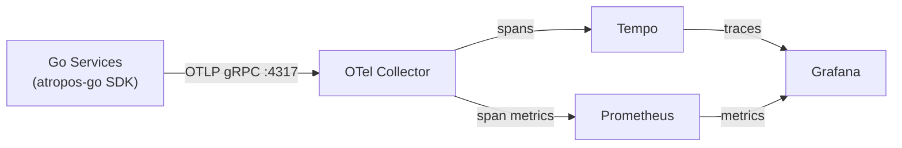

# Running the Full Stack: Service Beds + Atropos Fault Injection + Grafana

## Prerequisites

| Tool | Purpose |
|------|---------|
| [Docker Desktop](https://www.docker.com/products/docker-desktop/) | Container runtime |
| [Skaffold](https://skaffold.dev/docs/install/) | Build + deploy services |
| [kubectl](https://kubernetes.io/docs/tasks/tools/) | Kubernetes CLI |
| A local Kubernetes cluster | Minikube, Docker Desktop K8s, or kind |

> [!TIP]
> Docker Desktop ships with a built-in Kubernetes cluster. Enable it via **Settings → Kubernetes → Enable Kubernetes**.

---

## Step 1: Start the Service Mesh

```bash
cd service-beds/microservices-demo-go

# based on your OS run the following command to vendor the dependencies .sh for (linux/mac) and .bat for (windows)
.\run_vendor.bat or ./run_vendor.sh

skaffold run
```

This builds **11 Go microservices** (frontend, checkout, cart, currency, payment, shipping, email, product catalog, recommendation, ad, shopping assistant) plus the full observability stack:

| Component | K8s Service | Port |
|-----------|-------------|------|
| OTel Collector | `otel-collector` | 4317 (gRPC), 4318 (HTTP), 8889 (Prometheus) |
| Tempo (traces) | `tempo` | 3200 (HTTP), 4317 (gRPC) |
| Prometheus | `prometheus` | 9090 |
| Grafana | `grafana` | 3000 |
| Frontend (web UI) | `frontend-external` | 80 (LoadBalancer) |

> [!NOTE]
> First run takes several minutes to build all container images. Subsequent runs are incremental.

For live-reload during development, use `skaffold dev` instead.

---

## Step 2: Access the Services

### Frontend (Online Boutique)

```bash
kubectl port-forward svc/frontend-external 8080:80
```
Open: **http://localhost:8080**

### Grafana

```bash
kubectl port-forward svc/grafana 3000:3000
```
Open: **http://localhost:3000** — anonymous admin access is enabled, no login required.

A pre-provisioned **"Atropos Service Overview"** dashboard is available with panels for:
- CPU / Memory usage per service
- Ingress request rate, p50/p99 latency, error rate by status code
- Egress request rate, p50/p99 latency, error rate by status code

### Tempo (trace search)

Tempo is available as a Grafana data source. Go to **Explore → Tempo** to search traces by service name, span name, or trace ID.

### Prometheus

```bash
kubectl port-forward svc/prometheus 9090:9090
```
Open: **http://localhost:9090**

---

## Step 3: Generate Traffic

The load generator is commented out in [kustomization.yaml](file:///c:/Users/hello/Desktop/SwayamFolder/WorkMaterial/Projects/microserviceFaultTestingProject/service-beds/microservices-demo-go/kubernetes-manifests/kustomization.yaml) by default. To enable it:

**Option A — Uncomment the loadgenerator manifest:**

Edit [kubernetes-manifests/kustomization.yaml](file:///c:/Users/hello/Desktop/SwayamFolder/WorkMaterial/Projects/microserviceFaultTestingProject/service-beds/microservices-demo-go/kubernetes-manifests/kustomization.yaml) and uncomment the [loadgenerator.yaml](file:///c:/Users/hello/Desktop/SwayamFolder/WorkMaterial/Projects/microserviceFaultTestingProject/service-beds/microservices-demo-go/kubernetes-manifests/loadgenerator.yaml) line, then re-run `skaffold run`.

**Option B — Manual curl requests:**

```bash
# Browse products
curl http://localhost:8080/

# Add item to cart
curl -X POST http://localhost:8080/cart \
  -d '{"product_id":"OLJCESPC7Z","quantity":1}'
```

---

## Step 4: Inject Faults with Atropos

Services that integrate atropos-go expose a fault admin endpoint at `/admin/fault`. For example, the checkout service:

```bash
# Port-forward to checkoutservice
kubectl port-forward svc/checkoutservice 5050:5050
```

Then POST a fault spec to the admin endpoint:

```bash
# Inject a 2-second latency fault on ingress
curl -X POST http://localhost:5050/admin/fault \
  -H "Content-Type: application/json" \
  -d '{
    "type": "latency",
    "injection_point": "ingress",
    "duration": "2s"
  }'
```

> [!IMPORTANT]
> The exact payload schema for `/admin/fault` depends on what `atropos.FaultAdminHandler()` accepts. The atropos-go SDK is still evolving — check [atropos.go](file:///c:/Users/hello/Desktop/SwayamFolder/WorkMaterial/Projects/microserviceFaultTestingProject/atropos-go/atropos.go) and the `internal/interceptor` package for the current API shape.

### How Atropos is Wired into Services

Using [checkoutService/main.go](file:///c:/Users/hello/Desktop/SwayamFolder/WorkMaterial/Projects/microserviceFaultTestingProject/service-beds/microservices-demo-go/src/checkoutService/main.go) as an example:

```go
// 1. Bootstrap OTel + atropos
shutdown, _ := atropos.Init(ctx,
    atropos.WithServiceName("checkoutservice"),
    atropos.WithServiceVersion("0.1.0"),
)
defer shutdown(ctx)

// 2. Wrap outbound HTTP calls for egress tracing
httpClient := &http.Client{
    Transport: atropos.EgressTransport(http.DefaultTransport),
}

// 3. Expose metrics and fault admin endpoints
mux.Handle("GET /metrics", atropos.MetricsHandler())
mux.Handle("/admin/fault", atropos.FaultAdminHandler())

// 4. Wrap the mux with ingress middleware
handler := atropos.IngressMiddleware(mux, "checkoutservice")
```

Services send traces to the OTel Collector at `otel-collector:4317` (set via `COLLECTOR_SERVICE_ADDR` env var in the K8s manifests).

---

## Step 5: Observe in Grafana

1. Open **http://localhost:3000**
2. Go to **Dashboards → Atropos Service Overview**
3. Use the `$service` dropdown to filter by specific services
4. After injecting a fault, watch for:
   - **Latency spikes** in p50/p99 panels
   - **Error rate increases** in the error rate panels
   - **CPU/Memory changes** for resource faults
5. Go to **Explore → Tempo** to search for specific traces and see `fault.injected` / `fault.skipped` span events

---

## Data Flow



---

## Quick Reference

| Action | Command |
|--------|---------|
| Deploy everything | `skaffold run` |
| Deploy with live-reload | `skaffold dev` |
| Tear down | `skaffold delete` |
| Frontend | `kubectl port-forward svc/frontend-external 8080:80` |
| Grafana | `kubectl port-forward svc/grafana 3000:3000` |
| Prometheus | `kubectl port-forward svc/prometheus 9090:9090` |
| Inject fault | `curl -X POST http://localhost:<svc-port>/admin/fault -H "Content-Type: application/json" -d '{...}'` |
| View logs | `kubectl logs -f deploy/<service-name>` |
| Check pods | `kubectl get pods` |
