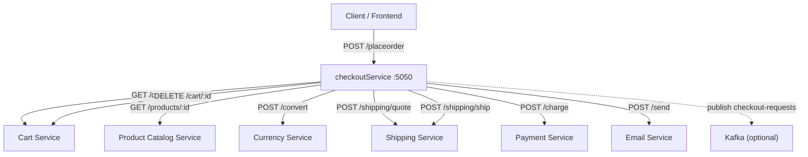
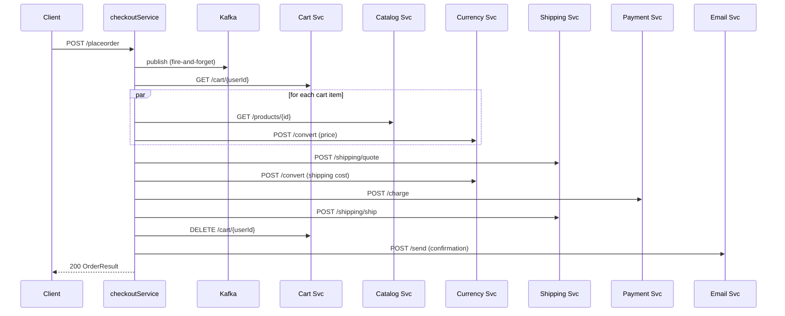

# Checkout Service — Complete Code Walkthrough

A Go-based HTTP microservice that orchestrates the checkout flow for an e-commerce platform. It is a faithful re-implementation of the original [Google Online Boutique](https://github.com/GoogleCloudPlatform/microservices-demo) checkout service, ported from gRPC to REST/HTTP and instrumented with the **Atropos** fault-injection SDK.

---

## High-Level Architecture



The service acts as an **orchestrator** — it owns no data itself but coordinates six downstream services to complete a checkout.

---

## File & Package Overview

| Path | Purpose |
|---|---|
| [main.go](file:///c:/Users/hello/Desktop/SwayamFolder/WorkMaterial/Projects/microserviceFaultTestingProject/service-beds/microservices-demo-go/src/checkoutService/main.go) | Entry point, HTTP handlers, all business logic |
| [models/model.go](file:///c:/Users/hello/Desktop/SwayamFolder/WorkMaterial/Projects/microserviceFaultTestingProject/service-beds/microservices-demo-go/src/checkoutService/models/model.go) | Request/response DTOs and domain types |
| [money/money.go](file:///c:/Users/hello/Desktop/SwayamFolder/WorkMaterial/Projects/microserviceFaultTestingProject/service-beds/microservices-demo-go/src/checkoutService/money/money.go) | Monetary arithmetic (sum, multiply, validation) |
| [kafka/producer.go](file:///c:/Users/hello/Desktop/SwayamFolder/WorkMaterial/Projects/microserviceFaultTestingProject/service-beds/microservices-demo-go/src/checkoutService/kafka/producer.go) | Thin Kafka producer wrapper |
| [Dockerfile](file:///c:/Users/hello/Desktop/SwayamFolder/WorkMaterial/Projects/microserviceFaultTestingProject/service-beds/microservices-demo-go/src/checkoutService/Dockerfile) | Multi-stage Docker build |
| [go.mod](file:///c:/Users/hello/Desktop/SwayamFolder/WorkMaterial/Projects/microserviceFaultTestingProject/service-beds/microservices-demo-go/src/checkoutService/go.mod) | Module & dependency definition |

---

## Section 1 — Initialization & Logger ([init()](file:///c:/Users/hello/Desktop/SwayamFolder/WorkMaterial/Projects/microserviceFaultTestingProject/service-beds/microservices-demo-go/src/checkoutService/main.go#33-46), lines 1-45)

```go
var log *logrus.Logger

func init() {
    log = logrus.New()
    log.Level = logrus.DebugLevel
    log.Formatter = &logrus.JSONFormatter{
        FieldMap: logrus.FieldMap{
            logrus.FieldKeyTime:  "timestamp",
            logrus.FieldKeyLevel: "severity",
            logrus.FieldKeyMsg:   "message",
        },
        TimestampFormat: time.RFC3339Nano,
    }
    log.Out = os.Stdout
}
```

### What it does
Creates a **global** `logrus.Logger` with JSON output, field-name remapping (`timestamp`, `severity`, `message`), and nanosecond-precision timestamps.

### Design Decisions & Tradeoffs

| Decision | Why | Alternatives | Tradeoff |
|---|---|---|---|
| **Global `logrus.Logger`** | Simple, accessible from any function without dependency injection | 1. Pass `*logrus.Logger` as a field on [checkoutService](file:///c:/Users/hello/Desktop/SwayamFolder/WorkMaterial/Projects/microserviceFaultTestingProject/service-beds/microservices-demo-go/src/checkoutService/main.go#47-58) struct (DI)<br>2. Use `slog` (stdlib, structured, zero-alloc) | Global state is harder to test and swap; DI is cleaner but adds boilerplate. `slog` is the Go-idiomatic choice since 1.21 but `logrus` was already the standard in the original demo. |
| **JSON formatter** | Machine-parseable; integrates with log aggregation (Loki, CloudWatch, ELK) | 1. `TextFormatter` for human readability<br>2. Custom formatter | JSON is the de-facto standard for containerised services feeding into observability stacks. |
| **Field remapping to `timestamp`, `severity`, `message`** | Matches GCP Cloud Logging field conventions so logs are auto-parsed by Stackdriver / Loki | Could keep the logrus defaults (`time`, `level`, `msg`) | Slightly couples the logging layer to the deployment environment, but saves configuring log parsing rules separately. |
| **[init()](file:///c:/Users/hello/Desktop/SwayamFolder/WorkMaterial/Projects/microserviceFaultTestingProject/service-beds/microservices-demo-go/src/checkoutService/main.go#33-46) for setup** | Guarantees the logger is ready before [main()](file:///c:/Users/hello/Desktop/SwayamFolder/WorkMaterial/Projects/microserviceFaultTestingProject/service-beds/microservices-demo-go/src/checkoutService/main.go#59-123) | Move setup into [main()](file:///c:/Users/hello/Desktop/SwayamFolder/WorkMaterial/Projects/microserviceFaultTestingProject/service-beds/microservices-demo-go/src/checkoutService/main.go#59-123) | [init()](file:///c:/Users/hello/Desktop/SwayamFolder/WorkMaterial/Projects/microserviceFaultTestingProject/service-beds/microservices-demo-go/src/checkoutService/main.go#33-46) is implicit / can be surprising; in [main()](file:///c:/Users/hello/Desktop/SwayamFolder/WorkMaterial/Projects/microserviceFaultTestingProject/service-beds/microservices-demo-go/src/checkoutService/main.go#59-123) you control ordering explicitly. For a single-binary service this is a minor concern. |

---

## Section 2 — Service Struct (lines 47-57)

```go
type checkoutService struct {
    productCatalogSvcAddr string
    cartSvcAddr           string
    currencySvcAddr       string
    shippingSvcAddr       string
    emailSvcAddr          string
    paymentSvcAddr        string
    httpClient            *http.Client
    kafkaProducer         *kafka.Producer
    kafkaEnabled          bool
}
```

### What it does
Central receiver that carries **all external dependencies** — downstream service addresses, an HTTP client, and an optional Kafka producer.

### Design Decisions & Tradeoffs

| Decision | Why | Alternatives | Tradeoff |
|---|---|---|---|
| **Single struct, no interfaces** | Simplicity; this is a thin orchestrator with little unit-testable logic | 1. Define interfaces per dependency (e.g. `CartClient`, `PaymentClient`) for mockability<br>2. Use a DI framework like `wire` | Interfaces add indirection and boilerplate. Without them, integration tests are the primary test strategy, which is acceptable given the service has minimal branching logic. |
| **Addresses as plain strings** | Config is flat: `host:port` resolved at startup | 1. Use `url.URL` structs for type-safety<br>2. Use a service-discovery client (Consul, DNS) | Strings are simple but error-prone (missing scheme, trailing slash, etc.). Fine when addresses come from env vars set by Kubernetes. |
| **Shared `*http.Client`** | Reuses connections across downstream calls (connection pooling) | 1. Create a client per downstream service (different timeouts)<br>2. Use a retry-aware client like `hashicorp/go-retryablehttp` | A single 10s timeout fits all calls here, but a payment call might warrant a longer timeout than a catalog lookup. Per-service clients would be more production-ready. |

---

## Section 3 — [main()](file:///c:/Users/hello/Desktop/SwayamFolder/WorkMaterial/Projects/microserviceFaultTestingProject/service-beds/microservices-demo-go/src/checkoutService/main.go#59-123) & Server Bootstrap (lines 59-122)

```go
func main() {
    // 1. Atropos SDK init
    shutdown, err := atropos.Init(ctx, ...)
    // 2. Env-based port override
    // 3. Build checkoutService with Atropos-wrapped HTTP client
    // 4. Load service addresses from env
    // 5. Optional Kafka producer
    // 6. Register routes
    // 7. Wrap mux in Atropos IngressMiddleware
    // 8. ListenAndServe
}
```

### Key sub-sections

#### 3a — Atropos SDK Integration (lines 63-72)

```go
shutdown, err := atropos.Init(ctx,
    atropos.WithServiceName("checkoutservice"),
    atropos.WithServiceVersion("0.1.0"),
)
```

Initializes OpenTelemetry tracing, metrics, and the fault-injection engine. The returned `shutdown` func flushes telemetry on exit.

#### 3b — Atropos-Wrapped HTTP Client (lines 78-83)

```go
httpClient: &http.Client{
    Transport: atropos.EgressTransport(http.DefaultTransport),
    Timeout:   10 * time.Second,
},
```

Wraps the default transport so that every **outbound** HTTP call is automatically:
- Traced (span propagation via `traceparent` header)
- Subject to fault injection (latency, errors) if configured

#### 3c — Environment Variables (lines 85-90)

```go
mustMapEnv(&svc.shippingSvcAddr, "SHIPPING_SERVICE_ADDR")
// ... 5 more ...
```

[mustMapEnv](file:///c:/Users/hello/Desktop/SwayamFolder/WorkMaterial/Projects/microserviceFaultTestingProject/service-beds/microservices-demo-go/src/checkoutService/main.go#L124-L130) panics if a required env var is missing — a fail-fast pattern that prevents the service from starting in a broken state.

#### 3d — Kafka Producer (lines 92-107)

Opt-in via `ENABLE_KAFKA=1`. A failure to connect **does not** crash the service; it degrades gracefully with a warning log.

#### 3e — Route Registration (lines 111-121)

```go
mux.HandleFunc("/placeorder", svc.handlePlaceOrder)
mux.HandleFunc("/_healthz", svc.handleHealth)
mux.Handle("GET /metrics", atropos.MetricsHandler())
mux.Handle("/admin/fault", atropos.FaultAdminHandler())

handler := atropos.IngressMiddleware(mux, "checkoutservice")
```

| Route | Purpose |
|---|---|
| `POST /placeorder` | Core business endpoint |
| `GET /_healthz` | Kubernetes liveness / readiness probe |
| `GET /metrics` | Prometheus scrape endpoint (via Atropos) |
| `/admin/fault` | Runtime fault-spec admin API (inject / list faults) |

The entire mux is wrapped in `atropos.IngressMiddleware`, which creates an **inbound** span for every incoming request and evaluates fault-injection rules.

### Design Decisions & Tradeoffs

| Decision | Why | Alternatives | Tradeoff |
|---|---|---|---|
| **stdlib `net/http` router** | Zero dependencies, Go 1.22+ supports method-based routing (`"GET /metrics"`) | 1. `chi` / `gorilla/mux` for path params, middleware chains<br>2. `gin` / `echo` for batteries-included frameworks | Stdlib is lightweight and sufficient for 4 routes. Third-party routers add richer middleware stacking and path-parameter parsing, but the routes here are simple enough not to need them. |
| **[mustMapEnv](file:///c:/Users/hello/Desktop/SwayamFolder/WorkMaterial/Projects/microserviceFaultTestingProject/service-beds/microservices-demo-go/src/checkoutService/main.go#124-131) — panic on missing env** | Fail-fast: the service cannot function without its dependencies | 1. Return errors from [main()](file:///c:/Users/hello/Desktop/SwayamFolder/WorkMaterial/Projects/microserviceFaultTestingProject/service-beds/microservices-demo-go/src/checkoutService/main.go#59-123) and exit gracefully<br>2. Provide defaults / fallbacks | Panicking gives an obvious stack trace in logs. Graceful error handling is preferable in libraries but acceptable in a top-level binary where the process should simply not start. |
| **Kafka opt-in, soft-fail** | Publishing checkout events is secondary to completing the checkout | 1. Hard-fail (panic if Kafka is unreachable)<br>2. Background retry loop with buffering | Soft-fail avoids blocking the critical path. The downside is silent data loss — events may be missed without alerting. A production system would want a dead-letter queue or persistent buffer. |
| **`atropos.IngressMiddleware` as outermost wrapper** | Ensures every request is instrumented and fault-eligible, including health checks | Could selectively apply middleware only to business routes | Wrapping the entire mux is simpler and ensures uniform telemetry; the slight overhead on `/_healthz` is negligible. |

---

## Section 4 — Health Check Handler (lines 132-137)

```go
func (cs *checkoutService) handleHealth(w http.ResponseWriter, r *http.Request) {
    w.Header().Set("Content-Type", "application/json")
    w.WriteHeader(http.StatusOK)
    json.NewEncoder(w).Encode(map[string]string{"status": "SERVING"})
}
```

Returns `{"status": "SERVING"}` unconditionally. This is a **shallow** health check.

### Design Decisions & Tradeoffs

| Decision | Why | Alternatives | Tradeoff |
|---|---|---|---|
| **Shallow (no dependency checks)** | Fast, non-flapping; Kubernetes can restart the pod if it's truly dead | 1. Deep check — ping each downstream service<br>2. Separate `/readyz` (deep) and `/livez` (shallow) endpoints | A deep check can cascade: if one downstream is slow, the orchestrator gets restarted too, amplifying the outage. Separating liveness from readiness is the K8s best practice. |

---

## Section 5 — [handlePlaceOrder](file:///c:/Users/hello/Desktop/SwayamFolder/WorkMaterial/Projects/microserviceFaultTestingProject/service-beds/microservices-demo-go/src/checkoutService/main.go#139-227) — The Checkout Orchestration (lines 139-226)

This is the **core business logic**. The flow is strictly sequential:



### Step-by-step breakdown

| Step | Code (lines) | What happens |
|---|---|---|
| 1. Validate method | 141-144 | Reject non-POST |
| 2. Decode request | 146-152 | JSON → [PlaceOrderRequest](file:///c:/Users/hello/Desktop/SwayamFolder/WorkMaterial/Projects/microserviceFaultTestingProject/service-beds/microservices-demo-go/src/checkoutService/models/model.go#56-63) |
| 3. Kafka publish | 156-164 | Fire-and-forget event (if enabled) |
| 4. Generate order ID | 166-171 | UUID v1 |
| 5. Prepare order | 173-178 | Fetch cart → enrich with prices → get shipping quote (see Section 6) |
| 6. Calculate total | 180-189 | Sum shipping + (item price × quantity) |
| 7. Charge card | 191-197 | Call payment service |
| 8. Ship order | 199-204 | Call shipping service |
| 9. Empty cart | 206 | Fire-and-forget DELETE |
| 10. Send confirmation | 216-220 | Fire-and-forget email, failures only warned |
| 11. Return response | 222-226 | JSON [PlaceOrderResponse](file:///c:/Users/hello/Desktop/SwayamFolder/WorkMaterial/Projects/microserviceFaultTestingProject/service-beds/microservices-demo-go/src/checkoutService/models/model.go#64-67) |

### Design Decisions & Tradeoffs

| Decision | Why | Alternatives | Tradeoff |
|---|---|---|---|
| **Sequential orchestration (Saga-like)** | Deterministic ordering: charge → ship → empty cart → email | 1. **Parallel** calls (faster wall-clock time)<br>2. **Choreography** via events (each service reacts independently) | Sequential is simpler to reason about and debug. Parallel would help latency but makes error handling and rollback harder. Choreography decouples services but introduces eventual consistency and requires a message broker. |
| **No compensating transactions / rollback** | If shipping fails _after_ payment, the charge is not reversed | 1. Implement compensating actions (refund on ship failure)<br>2. Use a Saga coordinator with explicit undo steps | This is a known simplification. A production system **must** handle partial failures — e.g., refund the card if [shipOrder](file:///c:/Users/hello/Desktop/SwayamFolder/WorkMaterial/Projects/microserviceFaultTestingProject/service-beds/microservices-demo-go/src/checkoutService/main.go#406-437) fails. |
| **UUID v1 for order ID** | Time-ordered, globally unique | 1. UUID v4 (random, no timestamp leakage)<br>2. ULID (sortable, URL-safe)<br>3. Snowflake ID | UUID v1 embeds the MAC address and timestamp, which can be a privacy concern. UUID v4 or ULID are safer choices for externally-exposed IDs. |
| **`_ = cs.emptyUserCart(req.UserID)`** — error ignored | Cart emptying is best-effort; the order is already placed | Could log the error, retry, or fail the order | Silently ignoring errors can lead to stale carts. At minimum, logging the error is cheap and aids debugging. |
| **Email failure is warn-only** | Non-critical; the order is committed | Could retry or enqueue for later delivery | Acceptable degradation — the user has the order ID in the HTTP response regardless. |

---

## Section 6 — Order Preparation ([prepareOrderItemsAndShippingQuoteFromCart](file:///c:/Users/hello/Desktop/SwayamFolder/WorkMaterial/Projects/microserviceFaultTestingProject/service-beds/microservices-demo-go/src/checkoutService/main.go#234-262), lines 228-261)

```go
func (cs *checkoutService) prepareOrderItemsAndShippingQuoteFromCart(...) (orderPrep, error) {
    cartItems := cs.getUserCart(userID)
    orderItems := cs.prepOrderItems(cartItems, userCurrency)  // parallel!
    shippingUSD := cs.quoteShipping(address, cartItems)
    shippingPrice := cs.convertCurrency(shippingUSD, userCurrency)
    return orderPrep{...}
}
```

An intermediate aggregation step that bundles cart items, enriched prices, and the shipping quote.

### Design Decisions & Tradeoffs

| Decision | Why | Alternatives | Tradeoff |
|---|---|---|---|
| **[orderPrep](file:///c:/Users/hello/Desktop/SwayamFolder/WorkMaterial/Projects/microserviceFaultTestingProject/service-beds/microservices-demo-go/src/checkoutService/main.go#228-233) struct as return type** | Groups related data without polluting the caller | 1. Return multiple named values<br>2. Mutate a passed-in pointer | A small struct is idiomatic Go for bundling related return values. Multiple return values become unwieldy beyond 3. |

---

## Section 7 — Concurrent Order Item Enrichment ([prepOrderItems](file:///c:/Users/hello/Desktop/SwayamFolder/WorkMaterial/Projects/microserviceFaultTestingProject/service-beds/microservices-demo-go/src/checkoutService/main.go#307-351), lines 307-350)

```go
func (cs *checkoutService) prepOrderItems(items []*models.CartItem, userCurrency string) ([]*models.OrderItem, error) {
    out := make([]*models.OrderItem, len(items))
    var wg sync.WaitGroup
    var mu sync.Mutex
    var errs []error

    for i, item := range items {
        wg.Add(1)
        go func(idx int, cartItem *models.CartItem) {
            defer wg.Done()
            product := cs.getProduct(cartItem.GetProductId())
            price := cs.convertCurrency(product.GetPriceUsd(), userCurrency)
            out[idx] = &models.OrderItem{Item: cartItem, Cost: price}
        }(i, item)
    }
    wg.Wait()

    if len(errs) > 0 {
        return nil, errors.Join(errs...)
    }
    return out, nil
}
```

### What it does
For each cart item, **concurrently**:
1. Fetches the product details (catalog service)
2. Converts the price to the user's currency (currency service)

### Design Decisions & Tradeoffs

| Decision | Why | Alternatives | Tradeoff |
|---|---|---|---|
| **Fan-out with `sync.WaitGroup`** | N items → N goroutines; minimises wall-clock latency for multi-item carts | 1. Sequential loop (simpler, slower)<br>2. Bounded concurrency with a semaphore / `errgroup` with limit | Unbounded fan-out can overwhelm downstream services if the cart has many items. `golang.org/x/sync/errgroup` with `SetLimit(n)` would be safer. |
| **`sync.Mutex` for error collection** | Thread-safe append to the shared `errs` slice | 1. Use a channel to collect errors<br>2. Use `errgroup` which returns the first error | Mutex + slice is straightforward. `errgroup` is more idiomatic and handles cancellation — if one item fails, it can cancel the rest. |
| **`errors.Join` for multi-error** | Aggregates all failures into a single error (Go 1.20+) | 1. Return only the first error<br>2. Use `go.uber.org/multierr` | `errors.Join` is stdlib and preserves all error info. Returning only the first error loses context. |
| **Pre-allocated [out](file:///c:/Users/hello/Desktop/SwayamFolder/WorkMaterial/Projects/microserviceFaultTestingProject/service-beds/microservices-demo-go/src/checkoutService/main.go#47-58) slice with index assignment** | Each goroutine writes to its own index — no locking needed for the output | 1. Append under mutex<br>2. Channel-based collection | Index-based writes are lock-free and preserve item ordering. This is an effective pattern whenever the output size is known. |

---

## Section 8 — Downstream Service Clients (lines 263-527)

All downstream client methods follow an identical pattern:

```go
func (cs *checkoutService) someCall(...) (T, error) {
    url := fmt.Sprintf("http://%s/path", cs.someAddr)
    // optional: marshal request body
    resp, err := cs.httpClient.{Get|Post|Do}(url, ...)
    // check error, check status code
    // decode JSON response
    return result, nil
}
```

### Individual methods

| Method | Downstream | HTTP Verb | Lines |
|---|---|---|---|
| [getUserCart](file:///c:/Users/hello/Desktop/SwayamFolder/WorkMaterial/Projects/microserviceFaultTestingProject/service-beds/microservices-demo-go/src/checkoutService/main.go#L263-L283) | Cart Service | `GET /cart/{userId}` | 263-283 |
| [emptyUserCart](file:///c:/Users/hello/Desktop/SwayamFolder/WorkMaterial/Projects/microserviceFaultTestingProject/service-beds/microservices-demo-go/src/checkoutService/main.go#L285-L305) | Cart Service | `DELETE /cart/{userId}` | 285-305 |
| [getProduct](file:///c:/Users/hello/Desktop/SwayamFolder/WorkMaterial/Projects/microserviceFaultTestingProject/service-beds/microservices-demo-go/src/checkoutService/main.go#L352-L372) | Product Catalog | `GET /products/{id}` | 352-372 |
| [quoteShipping](file:///c:/Users/hello/Desktop/SwayamFolder/WorkMaterial/Projects/microserviceFaultTestingProject/service-beds/microservices-demo-go/src/checkoutService/main.go#L374-L404) | Shipping Service | `POST /shipping/quote` | 374-404 |
| [shipOrder](file:///c:/Users/hello/Desktop/SwayamFolder/WorkMaterial/Projects/microserviceFaultTestingProject/service-beds/microservices-demo-go/src/checkoutService/main.go#L406-L436) | Shipping Service | `POST /shipping/ship` | 406-436 |
| [convertCurrency](file:///c:/Users/hello/Desktop/SwayamFolder/WorkMaterial/Projects/microserviceFaultTestingProject/service-beds/microservices-demo-go/src/checkoutService/main.go#L438-L468) | Currency Service | `POST /convert` | 438-468 |
| [chargeCard](file:///c:/Users/hello/Desktop/SwayamFolder/WorkMaterial/Projects/microserviceFaultTestingProject/service-beds/microservices-demo-go/src/checkoutService/main.go#L470-L500) | Payment Service | `POST /charge` | 470-500 |
| [sendOrderConfirmation](file:///c:/Users/hello/Desktop/SwayamFolder/WorkMaterial/Projects/microserviceFaultTestingProject/service-beds/microservices-demo-go/src/checkoutService/main.go#L502-L527) | Email Service | `POST /send` | 502-527 |

### Design Decisions & Tradeoffs

| Decision | Why | Alternatives | Tradeoff |
|---|---|---|---|
| **Repeated boilerplate (no generics/helper)** | Explicit and readable; each method is self-contained | 1. Generic `doPost[T any](url, body) (T, error)` helper<br>2. Code-generated clients from OpenAPI specs | The repetition is obvious. A generic helper would cut boilerplate by ~60%. Generated clients ensure type-safety and contract alignment with the downstream API. The current approach trades DRYness for clarity. |
| **No retries** | Keeps complexity low; retries can mask bugs | 1. `go-retryablehttp` with exponential backoff<br>2. Circuit breaker pattern (e.g. `sony/gobreaker`) | Without retries, transient network blips cause order failures. With retries (especially on non-idempotent calls like [chargeCard](file:///c:/Users/hello/Desktop/SwayamFolder/WorkMaterial/Projects/microserviceFaultTestingProject/service-beds/microservices-demo-go/src/checkoutService/main.go#470-501)), you risk double-charging. Idempotency keys would be needed. |
| **No context propagation** | `context.Context` is not threaded through HTTP calls | 1. Accept `context.Context` in each method and pass to `http.NewRequestWithContext` | Without context, there's no request-scoped cancellation or timeout per-call. The 10s client-level timeout is a blunt instrument. Context propagation is a must for production tracing. |
| **Hard-coding `http://` scheme** | All inter-service traffic is assumed plaintext (cluster-internal) | 1. Make scheme configurable<br>2. Use service mesh (Istio, Linkerd) for mTLS transparently | Acceptable inside a K8s cluster with a service mesh; without one, traffic is unencrypted. |

---

## Section 9 — Models Package ([models/model.go](file:///c:/Users/hello/Desktop/SwayamFolder/WorkMaterial/Projects/microserviceFaultTestingProject/service-beds/microservices-demo-go/src/checkoutService/models/model.go))

Defines all JSON-serializable DTOs. Notable patterns:

### Getter methods with nil-safety

```go
func (c *CartItem) GetQuantity() int32 {
    if c == nil { return 0 }
    return c.Quantity
}
```

### Design Decisions & Tradeoffs

| Decision | Why | Alternatives | Tradeoff |
|---|---|---|---|
| **Protobuf-style getters** | Matches the API of the original gRPC-generated code, easing the port | 1. Access fields directly (idiomatic Go)<br>2. Actually use protobuf + `protojson` | The nil-safe getters prevent panics on nil pointers, which is valuable when dealing with optional fields in JSON. Direct field access is simpler but requires nil checks at every call site. |
| **Flat package, single file** | All models in one place; easy to find | 1. One file per domain type<br>2. Separate `request` and `response` packages | A single file works well at this scale (~184 lines). Beyond ~500 lines, splitting by domain (cart, order, payment) improves navigability. |
| **`*Money` (pointer) for optional/nullable fields** | Distinguishes "not provided" from "zero value" | 1. Use value type [Money](file:///c:/Users/hello/Desktop/SwayamFolder/WorkMaterial/Projects/microserviceFaultTestingProject/service-beds/microservices-demo-go/src/checkoutService/models/model.go#4-9) + a separate `HasX()` method<br>2. Use `*Money` everywhere (current approach) | Pointers allow `nil` checks but introduce nil-pointer risks. The getter pattern mitigates this. |

---

## Section 10 — Money Package ([money/money.go](file:///c:/Users/hello/Desktop/SwayamFolder/WorkMaterial/Projects/microserviceFaultTestingProject/service-beds/microservices-demo-go/src/checkoutService/money/money.go))

A pure-arithmetic library for handling monetary values with **units** (whole) and **nanos** (fractional billionths) — the same representation as `google.type.Money` in protobuf.

### Key functions

| Function | Purpose |
|---|---|
| [IsValid](file:///c:/Users/hello/Desktop/SwayamFolder/WorkMaterial/Projects/microserviceFaultTestingProject/service-beds/microservices-demo-go/src/checkoutService/money/money.go#19-23) | Checks sign consistency and nanos range |
| [Sum](file:///c:/Users/hello/Desktop/SwayamFolder/WorkMaterial/Projects/microserviceFaultTestingProject/service-beds/microservices-demo-go/src/checkoutService/money/money.go#75-107) | Adds two [Money](file:///c:/Users/hello/Desktop/SwayamFolder/WorkMaterial/Projects/microserviceFaultTestingProject/service-beds/microservices-demo-go/src/checkoutService/models/model.go#4-9) values with carry/borrow |
| [MultiplySlow](file:///c:/Users/hello/Desktop/SwayamFolder/WorkMaterial/Projects/microserviceFaultTestingProject/service-beds/microservices-demo-go/src/checkoutService/money/money.go#108-118) | Multiplies by repeated addition |
| [Must](file:///c:/Users/hello/Desktop/SwayamFolder/WorkMaterial/Projects/microserviceFaultTestingProject/service-beds/microservices-demo-go/src/checkoutService/money/money.go#66-74) | Panic-on-error wrapper (like `template.Must`) |
| [Negate](file:///c:/Users/hello/Desktop/SwayamFolder/WorkMaterial/Projects/microserviceFaultTestingProject/service-beds/microservices-demo-go/src/checkoutService/money/money.go#58-65) | Flips the sign |

### Design Decisions & Tradeoffs

| Decision | Why | Alternatives | Tradeoff |
|---|---|---|---|
| **Units + Nanos (not float)** | Avoids floating-point precision errors in financial math | 1. `float64` (simple but imprecise)<br>2. `math/big.Rat` (arbitrary precision)<br>3. `shopspring/decimal` (popular decimal library) | Units+Nanos is the Google standard for money in protobuf and is exact. `shopspring/decimal` is more ergonomic but adds a dependency. Floats are **never** acceptable for money. |
| **[MultiplySlow](file:///c:/Users/hello/Desktop/SwayamFolder/WorkMaterial/Projects/microserviceFaultTestingProject/service-beds/microservices-demo-go/src/checkoutService/money/money.go#108-118) — O(n) multiplication** | Trivially correct; avoids overflow bugs in direct multiplication of units+nanos | 1. Direct multiplication: `units*n + carry(nanos*n)` | O(n) is fine for small quantities (e.g. 1-100 items). For large N, a direct multiply with proper carry logic would be O(1) and significantly faster. |
| **[Must](file:///c:/Users/hello/Desktop/SwayamFolder/WorkMaterial/Projects/microserviceFaultTestingProject/service-beds/microservices-demo-go/src/checkoutService/money/money.go#66-74) panics on error** | Used in the [Sum](file:///c:/Users/hello/Desktop/SwayamFolder/WorkMaterial/Projects/microserviceFaultTestingProject/service-beds/microservices-demo-go/src/checkoutService/money/money.go#75-107) call during total calculation where currency mismatch "should never happen" | 1. Return error and propagate<br>2. Log and use zero value | Panicking is acceptable when the invariant is guaranteed by the calling code (same currency). If the invariant could be violated by user input, this would be dangerous. |
| **No rounding / banker's rounding** | The nanos representation is exact for the operations performed | 1. Add explicit rounding to 2 decimal places for display | The caller (frontend) is responsible for display formatting. The backend preserves full precision. |

---

## Section 11 — Kafka Producer ([kafka/producer.go](file:///c:/Users/hello/Desktop/SwayamFolder/WorkMaterial/Projects/microserviceFaultTestingProject/service-beds/microservices-demo-go/src/checkoutService/kafka/producer.go))

A thin wrapper around the [franz-go](https://github.com/twmb/franz-go) Kafka client.

```go
type Producer struct {
    client *kgo.Client
    log    *logrus.Logger
}
```

### Key behaviors
- **Synchronous publish** (`ProduceSync`) — blocks until the broker acknowledges
- **Keyed messages** — uses `userID` as the key, so all events for a user go to the same partition (ordering guarantee)
- **Graceful close** via `defer p.Close()` in [main()](file:///c:/Users/hello/Desktop/SwayamFolder/WorkMaterial/Projects/microserviceFaultTestingProject/service-beds/microservices-demo-go/src/checkoutService/main.go#59-123)

### Design Decisions & Tradeoffs

| Decision | Why | Alternatives | Tradeoff |
|---|---|---|---|
| **franz-go over confluent-kafka-go / Sarama** | Pure Go, no CGo dependency (simpler Docker builds), actively maintained, high performance | 1. `confluent-kafka-go` (C librdkafka wrapper, battle-tested but needs CGo)<br>2. `Shopify/sarama` (deprecated)<br>3. `segmentio/kafka-go` (simple but less performant) | franz-go is the best modern choice for pure-Go Kafka. `confluent-kafka-go` has broader protocol coverage but complicates cross-compilation and Alpine Docker images. |
| **Synchronous publish** | Guarantees the message is acknowledged before returning | 1. Async produce with callback | Sync is simpler and guarantees delivery (at-least-once). Async would improve latency but requires handling failures in callbacks. Since this is already fire-and-forget in [handlePlaceOrder](file:///c:/Users/hello/Desktop/SwayamFolder/WorkMaterial/Projects/microserviceFaultTestingProject/service-beds/microservices-demo-go/src/checkoutService/main.go#139-227), sync here ensures the message at least reaches the broker if it's reachable. |
| **No schema registry / Avro** | Raw JSON payloads | 1. Avro with schema registry (type-safe, backward-compatible evolution)<br>2. Protobuf serialization | JSON is simple and human-readable for debugging. Schema registry is the production standard for evolving event schemas without breaking consumers. |

---

## Section 12 — Dockerfile (Multi-Stage Build)

```dockerfile
FROM golang:1.25.6-alpine AS builder
# ... copy, build with -mod=vendor ...

FROM alpine:3.22
COPY --from=builder /checkoutservice /src/checkoutservice
ENTRYPOINT ["/src/checkoutservice"]
```

### Design Decisions & Tradeoffs

| Decision | Why | Alternatives | Tradeoff |
|---|---|---|---|
| **Multi-stage build** | Build image (~1GB) is discarded; final image is ~10MB Alpine | 1. Single-stage (huge image)<br>2. `scratch` / `distroless` base (even smaller) | Alpine provides a shell for debugging. `scratch` or `distroless` would be even smaller and more secure (no shell, no package manager) but harder to debug in production. |
| **`-mod=vendor`** | Uses the vendored dependencies checked into the repo | 1. `go mod download` at build time (fetch from internet)<br>2. Proxy via `GOPROXY` | Vendoring ensures hermetic, reproducible builds with no network dependency. The tradeoff is a larger Git repo. For private modules (like `atropos-go`), vendoring avoids configuring auth in the Docker build. |
| **`CGO_ENABLED=0`** | Static binary, no libc dependency | Could enable CGo for performance-critical C libraries | Static binaries run on any Linux base image including `scratch`. CGo would require a glibc/musl-compatible base. |
| **`-ldflags="-s -w"`** | Strips debug symbols and DWARF info for smaller binary | Omit for debuggable production binaries | Reduces binary size by ~30%. Makes stack traces less informative, which can hinder post-mortem debugging. |

---

## Section 13 — Atropos Integration (Cross-Cutting)

The Atropos SDK is woven into three layers:

| Layer | Mechanism | Purpose |
|---|---|---|
| **Init** | `atropos.Init()` | Bootstraps OTel tracer/meter providers + fault engine |
| **Ingress** | `atropos.IngressMiddleware(mux)` | Creates a span for each inbound request; evaluates inbound fault rules |
| **Egress** | `atropos.EgressTransport(transport)` | Wraps outbound HTTP calls with span propagation + egress fault injection |
| **Admin** | `atropos.FaultAdminHandler()` | REST API to register/list/remove fault specs at runtime |
| **Metrics** | `atropos.MetricsHandler()` | Prometheus-compatible `/metrics` endpoint |

### Design Decisions & Tradeoffs

| Decision | Why | Alternatives | Tradeoff |
|---|---|---|---|
| **SDK-based instrumentation** | Minimal code changes; wraps existing `http.Client` and `ServeMux` | 1. Sidecar proxy (Envoy) for instrumentation<br>2. Manual OTel instrumentation | SDK approach gives fine-grained control and access to application-level context (user ID, order ID). Sidecar is language-agnostic but can't inject application-level faults. Manual OTel is flexible but verbose. |
| **Graceful degradation on init failure** | `atropos.Init` failure is a warning, not fatal | Could be made fatal to ensure observability is always active | Allows the service to function even if the OTel collector is unreachable. The downside is running blind — no traces or metrics — which defeats the purpose of the fault-testing platform. |

---

## Summary of Key Architectural Tradeoffs

| Area | Current Choice | Production Recommendation |
|---|---|---|
| Error handling | Partial — some errors silently ignored | Compensating transactions + dead-letter queues |
| Concurrency | Unbounded fan-out in [prepOrderItems](file:///c:/Users/hello/Desktop/SwayamFolder/WorkMaterial/Projects/microserviceFaultTestingProject/service-beds/microservices-demo-go/src/checkoutService/main.go#307-351) | `errgroup` with `SetLimit()` |
| Context propagation | Missing from downstream calls | Thread `context.Context` through all methods |
| Retries | None | Idempotent retries with exponential backoff |
| Testing | No interfaces → hard to unit test | Interface-based dependency injection |
| Logging | Global `logrus` | Per-request `slog.Logger` from context |
| Order ID | UUID v1 (leaks timestamp + MAC) | UUID v4 or ULID |
| Money math | [MultiplySlow](file:///c:/Users/hello/Desktop/SwayamFolder/WorkMaterial/Projects/microserviceFaultTestingProject/service-beds/microservices-demo-go/src/checkoutService/money/money.go#108-118) is O(n) | Direct multiplication with carry |
